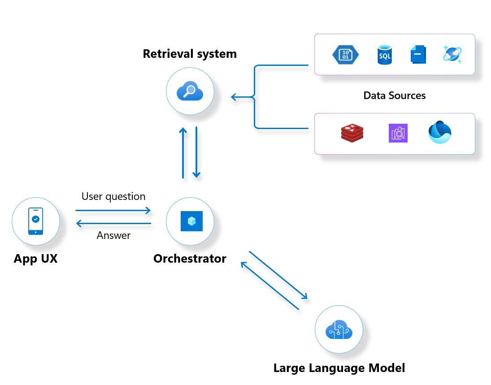
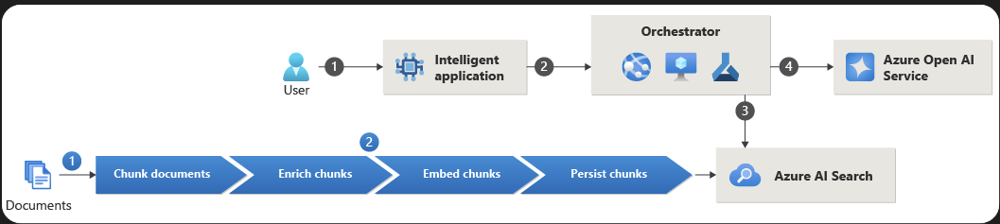

# RAG Workshop

## Retrieval: AI Search deepdive

### 1. Practical example: Populate your AI Search index

This example implements some open source (OSS) methods to evaluate RAG solutions.

At the end of this example, you will have a populated vector index in AI Search that we will use later.

> Go to [AI Search without indexer](./retrieval/AI-search-push/Readme.md)

### 2. Practical example: Use an AI Search Indexer to pull your data

Here we explore the JSON definitions for an AI Search ingestion pipeline. 
> Go to [AI Search Indexer example](./retrieval/AI-search-indexer/Readme.md)

## Orchestration: Promptflow deepdive

We'll introduce promptflow locally and then see how to use and deploy your flows to enterprise-grade endpoints with Azure ML. 
> Go to [Promptflow example](./orchestration/promptflow/Readme.md)

## Front end

A couple of simple local apps to interact with
- your search index
- your deployed promptflow endpoints. 

Key takeaway:
- your LLM calls and your data integration are now decoupled from the front end.

# Next steps:
- To implement end to end code-first implementation using AI search and promptflow with the help of the unified AI Studio SDKs, continue here:
  - https://learn.microsoft.com/en-gb/azure/ai-studio/tutorials/copilot-sdk-build-rag
